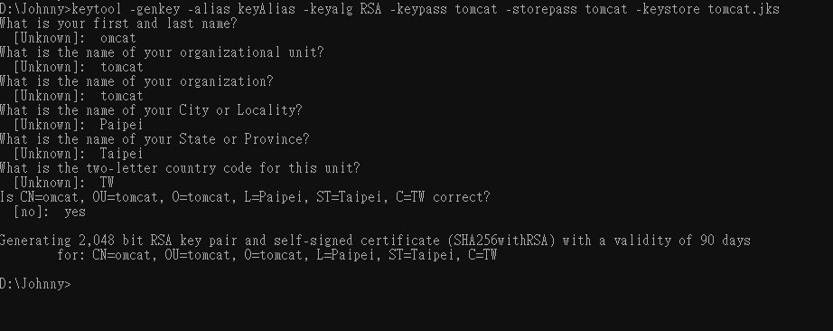

# JSK (Java Key Store)

<br>

---

<br>

當使用 SSL 連線的時候，Server 端與 Client 端都需要使用 SSL 憑證，這邊提供一個簡單的使用 jdk tool 製作憑證的方式。

<br>

```bash
keytool -genkey -alias keyAlias -keyalg RSA -keypass tomcat -storepass tomcat -keystore tomcat.jks
```

<br>



<br>

密碼設定為 `tomcat`

<br>

建檔名稱為 `tomcat.jks`